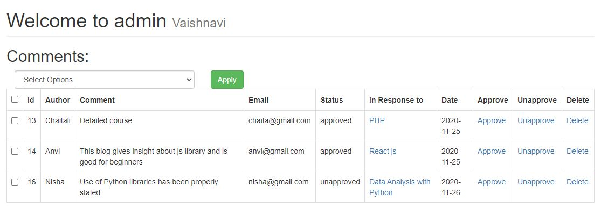

# CMS-using-PHP
Content Management System built in PHP
 
 The blogs which are published will be shown in the Home page.
+ Home

The new users/admin can create their account by registering themselves
+ Registration

Admin will get a view of the posts,comments through the dashboard
+ Dashboard

+ Posts 

+ Add new Posts:

+ Delete

+ Users 

+ Categories

The comments which are approved will be shown below blog posts.
+ Comments

